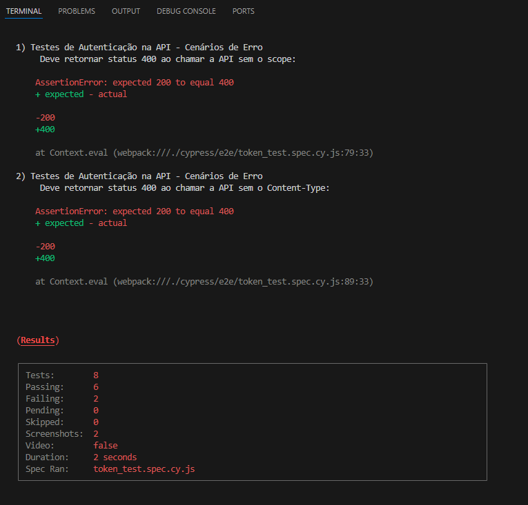
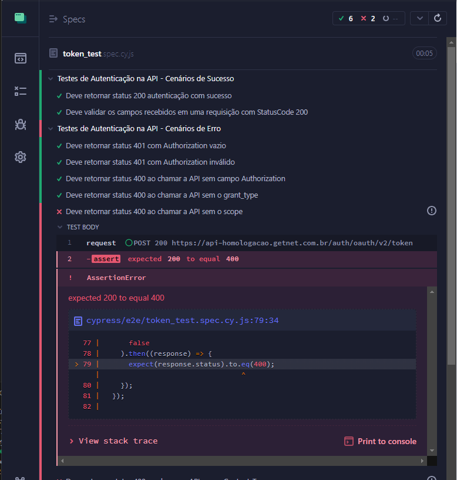
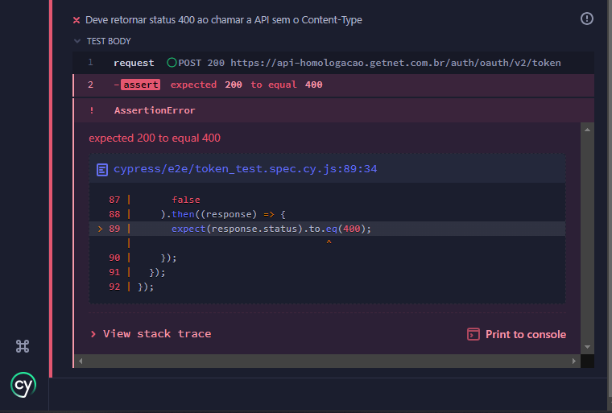

# Avaliação API

Desafio técnico para automação de testes de autenticação em uma API
 

 
## Dados do Projeto

Projeto desenvolvido com:

- [JavaScript](https://developer.mozilla.org/pt-BR/docs/Web/JavaScript)
- [Cypress](https://docs.cypress.io/guides/getting-started/installing-cypress)   

## Requisitos de configuração e execução:

- clonar o projeto para ambiente local com git clone  https://github.com/Edson86Nunes/CypressAPI.git
- instalar o cypress (caso não tenha) na pasta onde o projeto foi baixado

- executar: 
  
  `npm install cypress --save-dev`

- executar cypress modo gráfico:
 
  `npx cypress open`

- executar cypress modo headless:

  `npx cypress open`
    

### Testes:

## Evidências:

1) Ao chamar a API sem o campo 'scope' o retorno é 200(OK) e não 400(invalida)  

2) Ao chamar a API sem o campo 'Content-Type' o retorno é 200(OK) e não 400(invalida)  

 
 
